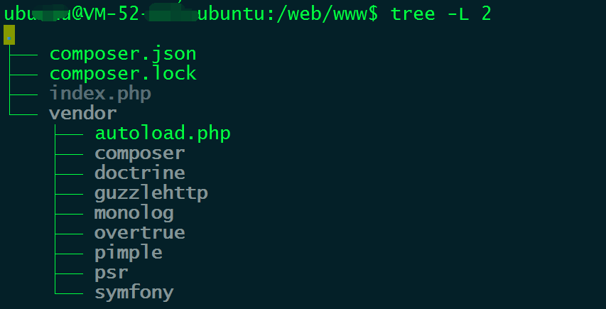
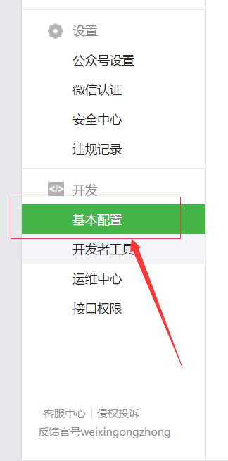
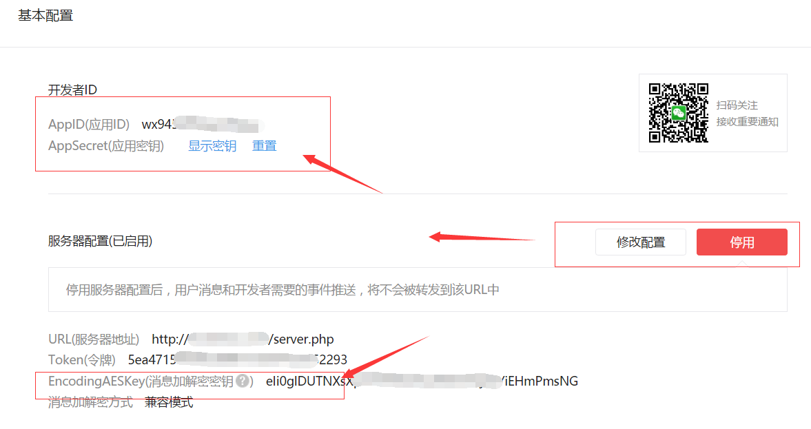
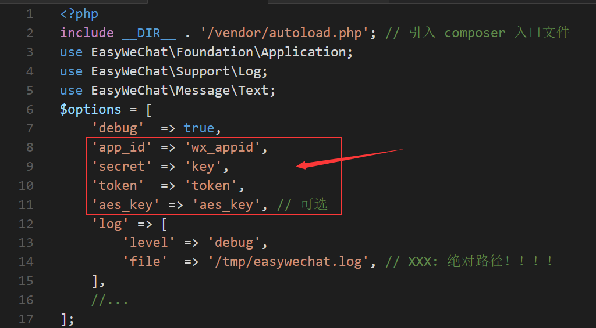
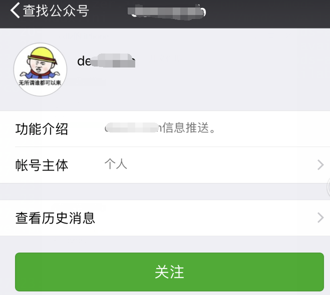
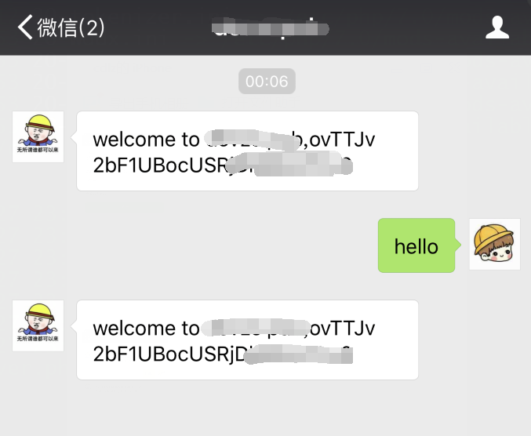

# mp_howto
微信个人订阅号后台server搭建入门教程

##搭建公众号后台server
以腾讯云自带的ubuntu14.04为例：

1.安装nginx+php7+mysql5,以及需要的扩展；
由于ubuntu14.04默认软件库为php5，需要加入第三方库，来apt-get方式安装PHP7；
当然，也可以直接在官网下载PHP7源码包编译；
上述过程可以使用一键安装脚本来完成，运行前，记得修改mysqldb的密码；

```bash
    sudo ./scripts/lnmp_14.04.setup.sh
```
2.安装PHP包管理工具composer：
官方步骤：
```php
    php -r "copy('https://getcomposer.org/installer', 'composer-setup.php');"
    php -r "if (hash_file('SHA384', 'composer-setup.php') === 'aa96f26c2b67226a324c27919f1eb05f21c248b987e6195cad9690d5c1ff713d53020a02ac8c217dbf90a7eacc9d141d') { echo 'Installer verified'; } else { echo 'Installer corrupt'; unlink('composer-setup.php'); } echo PHP_EOL;"
    php composer-setup.php
    php -r "unlink('composer-setup.php');"
```
为了方便，做以下几个设置：
```bash
    sudo mv composer.phar /usr/local/bin/composer.phar
    sudo echo '#!/bin/bash
    /usr/bin/php /usr/local/bin/composer.phar  $*' > /usr/local/bin/composer
    sudo chmod a+x /usr/local/bin/composer
```
同时将需要将composer软件库改到中文镜像：
```bash
    #全局修改方式
    composer config -g repo.packagist composer https://packagist.phpcomposer.com
```

3.借助第三方开源SDK，较快搭建基础框架：
以EasyWeChat为例： [EasyWeChatGithub](https://github.com/EasyWeChat,EasyWeChatGithub)
文档：[官方文档]（https://easywechat.org/zh-cn/docs/）
使用composer管理，进入第一步安装的nginxweb根目录： /web/www:
```bash
    composer require overtrue/wechat:~3.1 -vvv
```
此时即可初始化工程，生成compose.json：

调试可以按照上述结构组织代码，但是生产环境中，建议库还是放到非web目录下；

4.编写helloword：
直接见示例代码(可以和PHP Laravel等框架集成)：
```
www/server.php
```

##申请微信公众号
目前个人只能申请订阅号：
微信公众平台官方链接： [微信公众平台](https://mp.weixin.qq.com,微信公众平台)
申请过程就不一一描述了（需要完成个人身份认证，以及绑定管理微信号）；
申请好公众号之后，设置公众号后台响应入口，以及得到APIKEY之类的信息：



##修改配置和测试：
1.根据上述申请到的公众号api_id,key,token,写入server.php对应的变量中：


2.关注公众号，开始调试：




3.调试通过之后，即可按照需求实现功能了。

##善用腾讯云其他功能：
本次入门教程使用腾讯云提供的CVM云服务器，还有一些额外的工具可以使用：

1.使用https：
为了安全考虑，微信后台和我们自己公众号后台交互请求，建议是使用https;

[申请页面]( https://console.qcloud.com/ssl,申请页面)

请记住，腾讯云的SSL证书时免费的，免费的，免费的~ 
重要的事情说三遍~~

2.平台提供的安全工具：
购买云主机时，可以勾选对应的安全功能，开通后，
可以在[这里](https://console.qcloud.com/monitor/overview,管理入口)进行管理。

#Good luck!
好了，本次入门便介绍到这里，后续更精彩。。。
